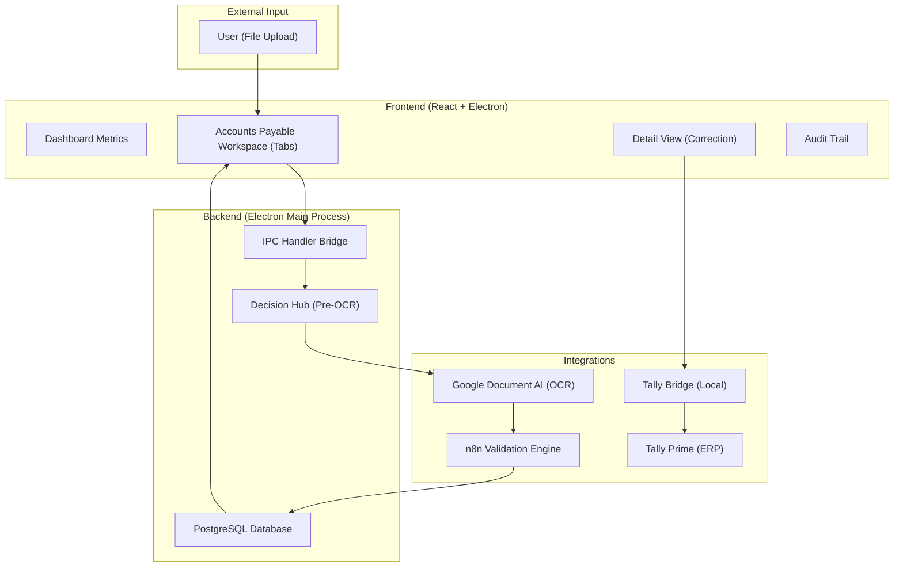
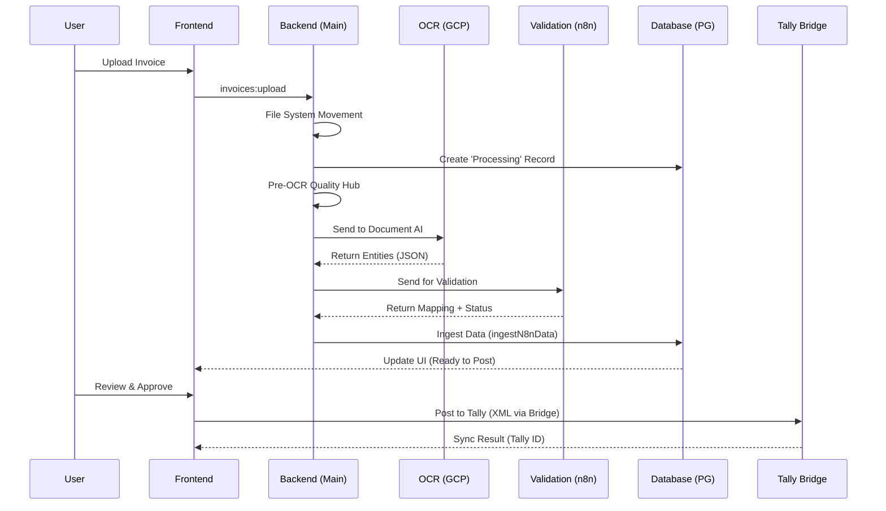
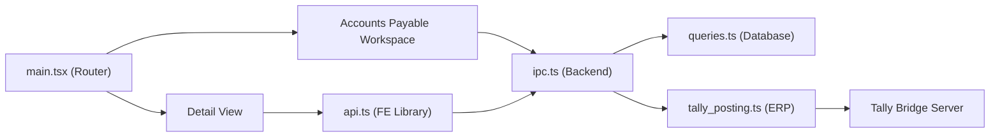

# Project Status Report: Fin-IQ Delivery Audit

## 1. Executive Summary
The Fin-IQ project is a mature invoice processing and ERP integration platform. The core value proposition—automated OCR extraction, multi-stage validation, and seamless Tally Prime synchronization—is architecturally sound and largely implemented. 

The system leverages a sophisticated pipeline where files move from raw upload through a "Decision Hub" for quality checks, into Google Document AI for extraction, through n8n for business rule validation, and finally into Tally Prime.

**Current Maturity Level:** **Moderate to Strong** (Core flows are functional; stability/edge-case handling is the current focus).

### Major Findings:
- **Completed Areas**: Invoice lifecycle management, frontend tab-based categorization, vendor/item master governance, and the Tally sync bridge.
- **Incomplete Areas**: Granular role-based access control (RBAC) in the UI, comprehensive loading/error state coverage for real-time processing, and advanced dashboard analytics.
- **Data Handling**: High maturity in structured data storage (JSONB for payloads, audit logs). Field mapping is robust but requires manual oversight for edge-case OCR errors.
- **Major Risks**: Google Cloud Document AI permission propagation delays (403 errors), dependency on local Tally Bridge connectivity, and missing loading states during "Pipeline" execution which may lead to user confusion.
- **Delivery Readiness**: **75% Readiness**. The system is ready for a managed demo but requires "Stabilization" before full production release.

---

## 2. Overall Project Drawing

---

## 3. End-to-End Data Flow Drawing

---

## 4. Page-wise / Module-wise Detailed Status

### Page/Module Name: Accounts Payable  Workspace (Document Hub)
#### Purpose
Central hub for managing the invoice lifecycle, categorized by processing status (Handoff, Review, Ready to Post, Posted).

#### Frontend Status
**Completed**
- Tab-based navigation (Handoff, Review, Ready to Post, etc.).
- Company-wide filtering and date-range selection.
- Multi-file upload interface.
- Real-time status badge updates.

**In Progress**
- Enhanced search across all tabs.

**Not Working / Issues**
- Refresh delay when moving invoices between tabs (requires manual click or re-fetch).

**UI/UX Improvements Recommended**
- Add visual progress bar for background OCR tasks.

#### Backend Status
**Completed**
- `invoices:get-all` handler with company filtering.
- `invoices:upload` with automated batch folder creation.
- `invoices:status-counts` for KPI synchronization.

**Missing / Should Be Added**
- Bulk approval/deletion features.

#### Data Handling Status
**Completed**
- Automated file path localization (moving from `source` to `completed`).
- UUID-based referencing for all records.

**Data Flow Review**
- Data moves from local file system to Postgres metadata, then to external services, and back to the specialized `ap_invoices` table.

---

### Page/Module Name: Detail View & Item Mapping
#### Purpose
Allows granular correction of OCR data, line-item ledger mapping, and final ERP posting.

#### Frontend Status
**Completed**
- Side-by-side PDF preview and data entry.
- Dynamic line-item table with autocomplete for ledgers.
- Vendor mapping and auto-creation slide-out.
- "Approve & Post to Tally" action button.

**Issues**
- Date format conversion logic (`DDMMYYYY` vs `YYYY-MM-DD`) previously caused out-of-range errors (Fixed).

**UI/UX Improvements Recommended**
- Keyboard shortcuts for navigating between fields.

#### Backend Status
**Completed**
- `invoices:get-by-id` and `invoices:get-items`.
- `invoices:update-ocr` for manual corrections.
- Integrated Tally posting webhook caller.

#### Data Handling Status
**Completed**
- Correct mapping of `sub_total`, `tax_total`, and `grand_total` to backend columns.
- Robust date parsing for the `invoice_date` (PostgreSQL `DATE` compatibility).

**Data Validation Review**
- **Required**: Invoice No, Date, Vendor, Total Amount.
- **Format**: Date must be `DDMMYYYY` for Tally posting.
- **Duplicate Prevention**: Handled via n8n/DB unique constraint on `invoice_number` + `vendor_id`.

---

### Page/Module Name: Tally Integration (Bridge & Posting)
#### Purpose
Synchronizes invoice data with local Tally Prime instances and fetches Purchase Orders.

#### Frontend Status
**Completed**
- Connection status indicator (Tally Bridge/OCR).
- Tally ID tracking on posted invoices.

**Missing**
- Detailed "Sync Logs" viewer in the main UI (recently removed per user request, but needed for troubleshooting).

#### Backend Status
**Completed**
- Webhook bridge to n8n for Tally XML generation.
- Local `tally-bridge` server to overcome CORS and local network restrictions.
- `markPostedToTally` function to capture ERP response.

#### Data Handling Status
**Completed**
- XML payload forwarding to local Tally port (9000).
- Normalization of Tally's nested XML response into clean JSON.

**Risks**
- Tally port (9000) conflict or bridge offline status is not yet "auto-healed".

---

## 5. Cross-Module Gaps
- **Validation Strategy**: Validation is heavily reliant on n8n. If n8n is offline, invoices stay in "Processing" indefinitely without a timeout notification.
- **Audit Trails**: While events are logged, there is no "Revert" functionality for accidental deletions or status changes.
- **Error Handling**: A "Pipeline Halted" error occurs if OCR fails, but the UI doesn't always show the *exact* reason (e.g., "403 Permission Denied") without checking logs.

---

## 6. Cross-Module Dependency Drawing

---

## 7. Overall Data Handling Assessment
**Data Handling Maturity: Moderate**

The system uses a highly structured approach to data. Using `JSONB` for raw payloads ensures no data is lost during extraction, even if a schema field is missing. The `ingestN8nData` function is a critical "Smart Connector" that translates external validation results into internal database states.

**Major Risks:**
- **Manual Overrides**: Users can edit amounts in the UI, potentially creating a desync between the "OCR Raw Payload" and the "Final Posted Amount."
- **Schema Gaps**: Some legacy records might lack specialized fields like `vendor_gst`.

---

## 8. Client View: Ready vs Needs Work
### Ready for Demo
- Full "Upload to Post" lifecycle.
- Dashboard KPI tracking.
- Vendor/Item Master visibility.
- Audit Trail visibility.

### Needs Work
- Resilience to Google Cloud permission propagation (Needs documented setup guide).
- Loading states during the 10-15 second OCR/Validation window.
- Recovery from "Failed" status (Re-run pipeline button).

---

## 9. Recommended Delivery Plan
- **Phase 1 – Critical Fixes**: Ensure 100% OCR uptime by finalizing GCP role assignments. Add "Re-run" buttons for failed invoices.
- **Phase 2 – Data Stabilization**: Implement field-level validation on the frontend to prevent "Bad Data" from reaching n8n.
- **Phase 3 – Client Demo Readiness**: Add tooltips and empty states (e.g., "No Invoices Found").

---

## 10. Final Status Matrix
| Page / Module | Frontend Status | Backend Status | Data Handling Status | Overall Status | Key Gap | Priority |
| :--- | :--- | :--- | :--- | :--- | :--- | :--- |
| **Accounts Payable  Workspace** | Done | Done | Strong | **Done** | Tab desync/refresh | High |
| **Detail View** | Done | Done | Moderate | **Done** | Keyboard shortcuts | High |
| **OCR Pipeline** | In Progress | Done | Moderate | **Partial** | 403 Permission Help | High |
| **Tally Sync** | Done | Done | Strong | **Done** | Log Visibility | Medium |
| **Dashboard** | Done | Done | Weak | **Partial** | Historical Charts | Low |

---

## 11. Final Observations
- **Strongest Area**: The **ingestN8nData** logic is excellent, providing a flexible way to handle complex validations without hardcoding them in the core app.
- **Weakest Area**: **UI Feedback** during long-running async processes (OCR/Validation).
- **Hidden Risk**: The local `tally-bridge` requires manual startup (`npm start`). It should ideally be bundled with the Electron app service.

---

## 12. Final Deliverables

### A. Client-Friendly Short Summary
Fin-IQ has reached its "Feature Complete" milestone for the primary invoice workflow. Users can now upload, validate, and post invoices to Tally Prime with high accuracy. The current focus is on finalizing Google Cloud permissions to ensure 100% uptime for the OCR engine.

### B. Internal Team Summary
The IPC bridge and PostgreSQL schema are stable. The `ingestN8nData` function prevents previous UUID mismatch issues. Priority 1 is implementing a robust "Reconnect" feature for the OCR service and improving UI loading skeletons.

### C. Top 10 Immediate Action Items
1.  Verify GCP Role: Assign "Document AI Viewer" to avoid 403 errors.
2.  Add "Re-run OCR" button to the UI for failed records.
3.  Implement "Auto-refresh" on tab changes in Accounts Payable  Workspace.
4.  Standardize Loading Skeletons for Accounts Payable  Workspace tabs.
5.  Bundle `tally-bridge` startup with Electron main process.
6.  Add Field-level regex validation for GSTIN in Detail View.
7.  Implement bulk status updates (e.g., delete all Failed).
8.  Create a "Setup Wizard" for Config page (Port 9000 check).
9.  Add "Export to CSV" for Audit logs.
10. Final verification of Line Item ledger mapping consistency.
