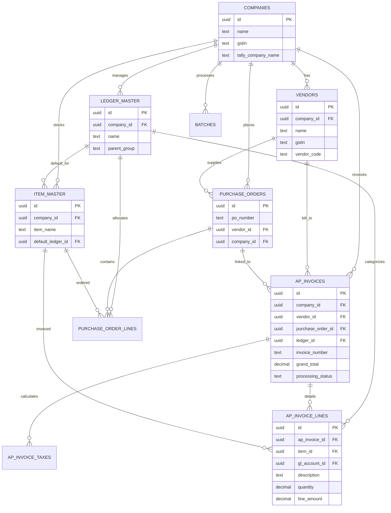

# Database Schema Overview

This document provides a detailed overview of the `agent_ai_tally` database schema and the relationships between its core entities.

## ER Diagram

## Core Entities & Relationships

### 1. Companies (`companies`)
The root entity. All data (vendors, invoices, ledgers) is partitioned by `company_id`. It also stores Tally integration settings (URL, company name, port).

### 2. Vendors (`vendors`)
Entities from whom the company purchases goods/services.
- **Relates to Companies**: Each vendor belongs to a specific company.
- **Relates to Invoices/POs**: Vendors are the source of `ap_invoices` and `purchase_orders`.

### 3. Accounts Payable  Invoices (`ap_invoices`)
The central transaction table in the Accounts Payable  Workspace.
- **Relates to Vendors**: Identifies who issued the invoice.
- **Relates to POs**: Optional link to a `purchase_order_id` for 2-way/3-way matching.
- **Relates to Ledgers**: Optional direct link to a `ledger_id` for expense booking.
- **Relates to Lines**: Contains multiple `ap_invoice_lines`.

### 4. Ledger Master (`ledger_master`)
The Chart of Accounts (COA) or Tally Ledgers.
- **Relates to Lines**: Each invoice line or PO line is mapped to a ledger for accounting purposes.

### 5. Purchase Orders (`purchase_orders`)
Authorized orders issued to vendors.
- **Relates to Vendors & Companies**: Linked to both for context.
- **Relates to Lines**: Contains `purchase_order_lines`.

### 6. Item Master (`item_master`)
The inventory or service catalog.
- **Relates to Ledgers**: Often has a `default_ledger_id` to automate accounting during data entry.
- **Relates to Lines**: PO and Invoice lines reference items from this master.

### 7. Support Tables
- **`batches`**: Groups multiple uploaded invoice files for processing.
- **`audit_logs`**: Tracks changes to entities (invoices, vendors).
- **`app_config`**: Stores company-specific settings and preferences.
- **`tally_sync_logs`**: Records the XML requests/responses during integration syncs.
